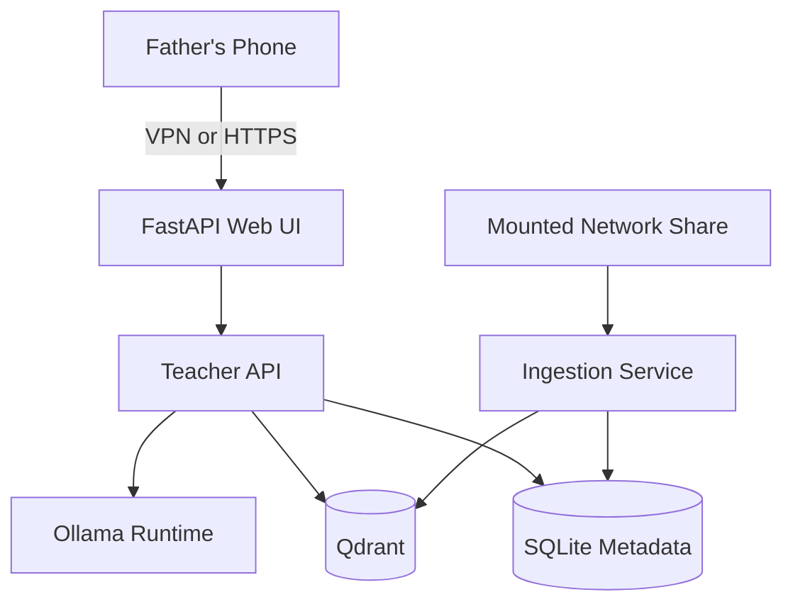

# ai-teacher

Self-hosted Hungarian teacher-agent MVP for a private document library.

This repository is intentionally separate from any GPU image-generation stack. It has its own Compose files, Ansible playbooks, service names, data directories, documentation, and deployment assumptions.

## What This Repo Implements

- Mounted network-share based document library access
- Incremental document ingestion for PDF, EPUB, TXT, Markdown, and DOCX
- Local metadata state in SQLite
- Local vector search in Qdrant
- Local LLM runtime via Ollama
- Hungarian-first RAG chat API and mobile-friendly web UI
- Ansible-driven deployment to a separate VM
- Optional NVIDIA and optional voice scaffolding

## Chosen MVP Stack

- UI and API: custom `FastAPI` service
- RAG storage: `Qdrant`
- Metadata and ingestion state: `SQLite`
- Local inference runtime: `Ollama`
- Embeddings: `sentence-transformers` with `intfloat/multilingual-e5-base`
- Ingestion glue: custom lightweight service reading from the mounted share
- Remote access: prefer `WireGuard` or `Tailscale`; optional reverse proxy

Why this stack:

- It stays small enough for `1x RTX 3070`, `8 GB VRAM`, `16 GB RAM`
- It avoids a heavy all-in-one AI platform
- It keeps custom code limited to ingestion and RAG glue
- It is easy to migrate to another VM later

## Resource Expectations

- Do not assume the full library fits on local SSD.
- Source documents remain on the mounted share.
- Indexed chunk text, vectors, SQLite metadata, model cache, and logs are stored locally.
- 7B to 8B quantized chat models are the practical starting point for `8 GB VRAM`.
- Voice is optional because Hungarian STT/TTS quality and resource use need separate validation.

## Quick Start

1. Copy `.env.example` to `.env` and adjust paths and credentials.
2. Ensure your network share is mounted at `TEACHER_MOUNT_POINT`.
3. Start the local dev stack:

```bash
make dev-up
```

4. Pull a chat model into Ollama from inside the running container:

```bash
docker compose --env-file .env -f compose/docker-compose.yml -f compose/docker-compose.dev.yml exec ollama ollama pull qwen2.5:7b-instruct-q4_K_M
```

5. If you need LAN access during testing, set `TEACHER_HTTP_BIND=0.0.0.0` in `.env`.

6. Trigger indexing:

```bash
curl -X POST http://127.0.0.1:8081/ingest/reindex \
  -H 'Content-Type: application/json' \
  -d '{"full_reindex": false, "remove_missing": true}'
```

7. Open the UI:

```text
http://127.0.0.1:8080
```

## Architecture



## Security Warnings

- Do not expose the UI publicly without VPN or HTTPS plus authentication.
- Do not commit network-share credentials or `.env`.
- Prefer `WireGuard` or `Tailscale` for phone access.
- If you expose over HTTPS, enable app auth and/or reverse-proxy auth.
- Indexed chunk text is stored locally. Treat the local SSD as sensitive data.

## Repo Layout

The repo is structured for deployment first:

- `compose/` for runtime definitions
- `ansible/` for deployment and share mounting
- `services/` for the thin custom glue services
- `config/` for prompts and operator-facing examples
- `docs/` for architecture, ops, security, and staged voice decisions

## Current Status

Implemented now:

- Separate deployable stack scaffold
- Text-first RAG flow
- Share-aware ingestion service
- Incremental indexing behavior
- Mobile-friendly web UI
- Ansible structure and deployment roles
- Optional voice placeholder service

Not fully implemented yet:

- OCR for scanned PDFs
- MOBI/AZW conversion pipeline
- Production-grade SSO or identity provider integration
- Real Hungarian offline STT/TTS backend wiring

## Next Docs

- [Architecture](docs/architecture.md)
- [Ansible Deploy](docs/ansible-deploy.md)
- [Network Share](docs/network-share.md)
- [Document Ingestion](docs/document-ingestion.md)
- [Model Selection](docs/model-selection.md)
- [Mobile Access](docs/mobile-access.md)
- [Voice Hungarian](docs/voice-hungarian.md)
- [Security](docs/security.md)
- [Operations](docs/operations.md)
- [Open Questions](docs/open-questions.md)
