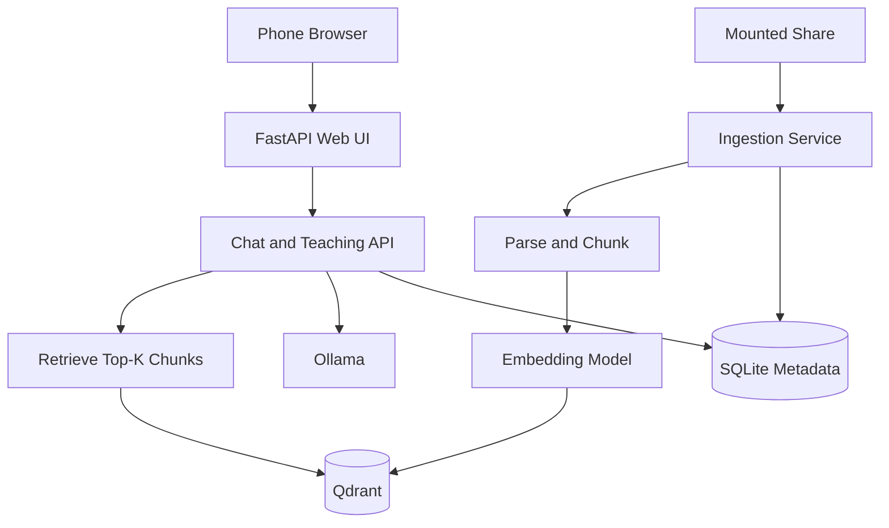
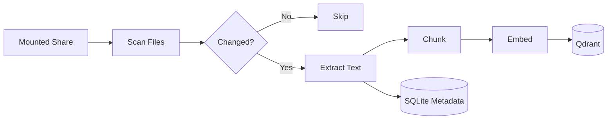
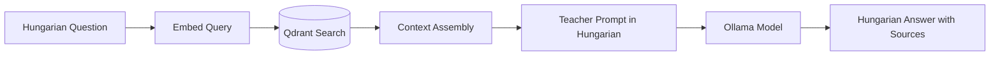
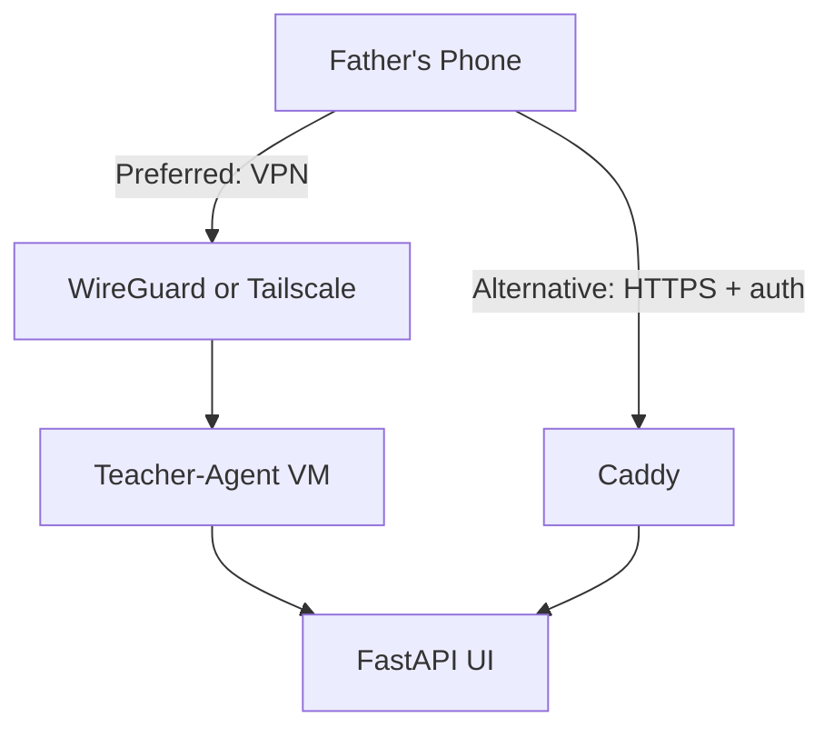
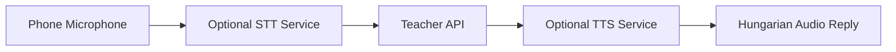
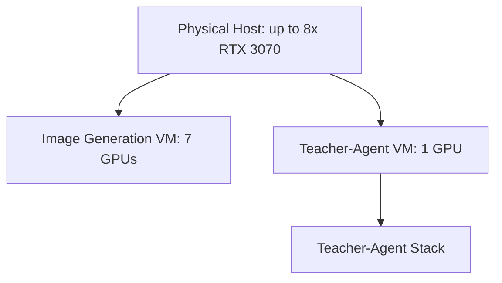

# Architecture

The MVP is a text-first RAG system designed for a dedicated teacher-agent VM. It is intentionally separate from any other AI workload stack.

## Core Services

- `api`: mobile-friendly web UI and JSON API
- `ingestion`: scans the mounted share and updates local indexes
- `qdrant`: vector storage
- `ollama`: local LLM runtime
- `sqlite`: local metadata state stored on the host, not a separate container
- `voice`: optional future service for STT/TTS

## High-Level Flow

## Ingestion Flow

## Chat Flow

## Mobile Access Flow

## Optional Voice Flow

## VM Split Example

## Design Notes

- The source library remains on the share.
- Index data lives locally for speed.
- Chunk text is stored locally as part of the RAG index payload.
- Sequential ingestion is a deliberate default to protect `16 GB RAM`.

